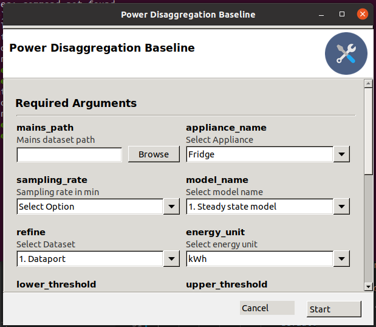
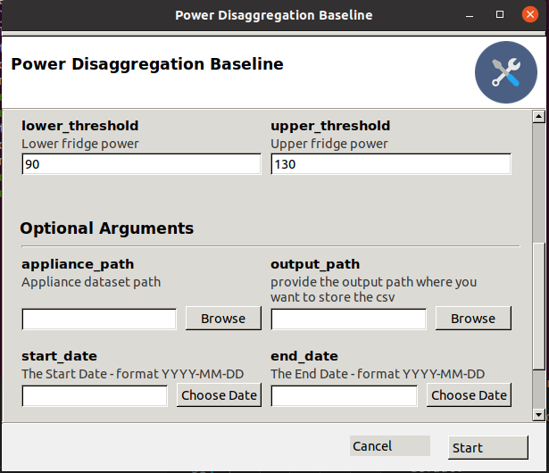
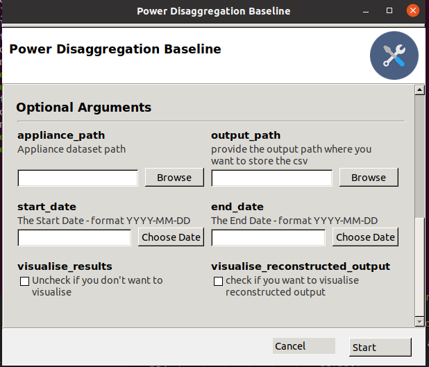

# Baseline Model for NILM
### About The Project

The objective of this project is to obtain insights on the devices being operated in the household using the mains meter reading. The meter readings are analysed using machine learning techniques to obtain valuable insights


## Getting Started
### Set-up

The code can run in any version of Python 
Install pip and install the required libs
```
sudo apt-get install python3-pip python3-venv
sudo pip install -r requirements.txt
```


### Gooey GUI and Usage






   

### Results 
The module can be executed with and wihout the ground truth data. Some of results obtained are :  
1. ChattisGarh Data Fridge Disaggregation with MODEL 1 sampled at 15 Mins

2. ChattisGarh Data Fridge Disaggregation with MODEL 2 sampled at 15 Mins


3. Delhi Data Fridge Disaggregation with MODEL 1 sampled at 15 Mins

4. Delhi Data Fridge Disaggregation with MODEL 2 sampled at 15 Mins


5. DataPort Data Fridge Disaggregation with MODEL 1 sampled at 15 Mins

6. Dataport Data Fridge Disaggregation with MODEL 2 sampled at 15 Mins


7. Dataport Data AC Disaggregation with MODEL 1 sampled at 15 Mins : 


